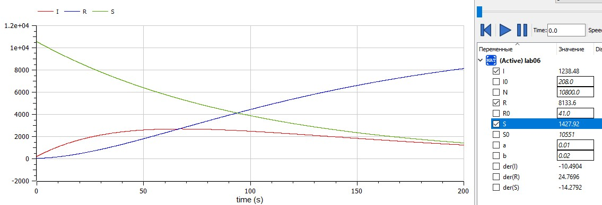

---
## Front matter
lang: ru-RU
title: "Лабораторная работа №6"
author: |
    Рыбалко Элина\inst{1}

institute: |
	\inst{1}RUDN University, Moscow, Russian Federation
  
date: 2022, 11 March, 2022 Murom, Russian Federation  

## Formatting
mainfont: PT Serif
romanfont: PT Serif
sansfont: PT Sans
monofont: PT Mono
toc: false
slide_level: 2
theme: metropolis
header-includes: 
 - \metroset{progressbar=frametitle,sectionpage=progressbar,numbering=fraction}
 - '\makeatletter'
 - '\beamer@ignorenonframefalse'
 - '\makeatother'
aspectratio: 43
section-titles: true
---

# Прагматика выполнения лабораторной работы 

 - Изучение основ математического моделирования.

 - Умение строить траектории движения в теории и визуализировать их.

# Цель выполнения лабораторной работы

  Рассмотреть простейшую модель эпидемии.

# Задачи выполнения лабораторной работы

  На одном острове вспыхнула эпидемия. Известно, что из всех проживающих на острове ($N=10800$) в момент начала эпидемии $(t=0)$ число заболевших людей (являющихся распространителями инфекции) I(0)=208, А число здоровых людей с иммунитетом к болезни $R(0)=41$. Таким образом, число людей восприимчивых к болезни, но пока здоровых, в начальный момент времени $S(0)=N-I(0)-R(0)$.
  Постройте графики изменения числа особей в каждой из трех групп.  
  Рассмотрите, как будет протекать эпидемия в случае:  
  1) Если $I(0)<=I$*  
  2) Если $I(0)>I$* 

# Результат выполнения лабораторной работы

  { #fig:001} 

# Результат выполнения лабораторной работы

  { #fig:002}

# Результат выполнения лабораторной работы

  { #fig:003} 

# Вывод

  Рассмотрели простейшую модель эпидемии