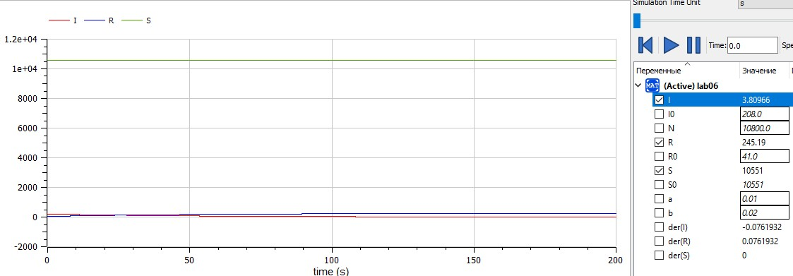
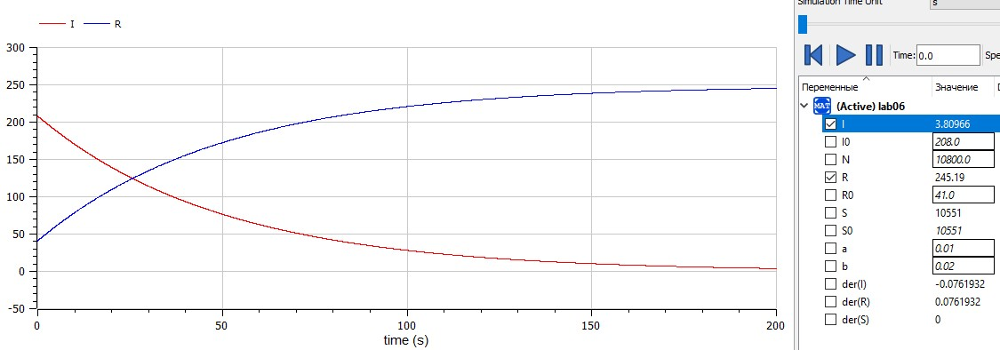
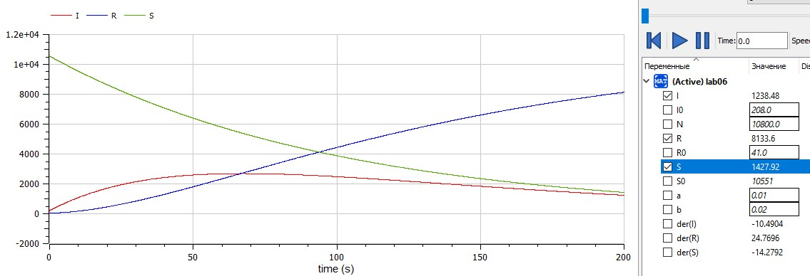

---
# Front matter
lang: ru-RU  
title: "Отчёт по лабораторной работе №6"  
subtitle: "дисциплина: Математическое моделирование"  
author: "Рыбалко Элина Павловна"  

# Generic otions
lang: ru-RU
toc-title: "Содержание"

# Bibliography
bibliography: bib/cite.bib
csl: pandoc/csl/gost-r-7-0-5-2008-numeric.csl

# Pdf output format
toc: true # Table of contents
toc_depth: 2
lof: true # List of figures
lot: true # List of tables
fontsize: 12pt
linestretch: 1.5
papersize: a4
documentclass: scrreprt
## I18n
polyglossia-lang:
  name: russian
  options:
  - spelling=modern
  - babelshorthands=true
polyglossia-otherlangs:
  name: english
### Fonts
mainfont: PT Serif
romanfont: PT Serif
sansfont: PT Sans
monofont: PT Mono
mainfontoptions: Ligatures=TeX
romanfontoptions: Ligatures=TeX
sansfontoptions: Ligatures=TeX,Scale=MatchLowercase
monofontoptions: Scale=MatchLowercase,Scale=0.9
## Biblatex
biblatex: true
biblio-style: "gost-numeric"
biblatexoptions:
  - parentracker=true
  - backend=biber
  - hyperref=auto
  - language=auto
  - autolang=other*
  - citestyle=gost-numeric
## Misc options
indent: true
header-includes:
  - \linepenalty=10 # the penalty added to the badness of each line within a paragraph (no associated penalty node) Increasing the value makes tex try to have fewer lines in the paragraph.
  - \interlinepenalty=0 # value of the penalty (node) added after each line of a paragraph.
  - \hyphenpenalty=50 # the penalty for line breaking at an automatically inserted hyphen
  - \exhyphenpenalty=50 # the penalty for line breaking at an explicit hyphen
  - \binoppenalty=700 # the penalty for breaking a line at a binary operator
  - \relpenalty=500 # the penalty for breaking a line at a relation
  - \clubpenalty=150 # extra penalty for breaking after first line of a paragraph
  - \widowpenalty=150 # extra penalty for breaking before last line of a paragraph
  - \displaywidowpenalty=50 # extra penalty for breaking before last line before a display math
  - \brokenpenalty=100 # extra penalty for page breaking after a hyphenated line
  - \predisplaypenalty=10000 # penalty for breaking before a display
  - \postdisplaypenalty=0 # penalty for breaking after a display
  - \floatingpenalty = 20000 # penalty for splitting an insertion (can only be split footnote in standard LaTeX)
  - \raggedbottom # or \flushbottom
  - \usepackage{float} # keep figures where there are in the text
  - \floatplacement{figure}{H} # keep figures where there are in the text
---

# Цель работы

  Рассмотреть простейшую модель эпидемии.  

## Объект исследования

  Модель эпидемии.

## Предмет исследования

  Алгоритм решения задачи об эпидемии.

# Теоретическое введение

  Предположим, что некая  популяция, состоящая из $N$ особей, (считаем, что популяция изолирована)  подразделяется на три группы. Первая группа - это восприимчивые к болезни, но  пока здоровые особи, обозначим их через $S(t)$. Вторая группа – это число  инфицированных особей, которые также при этом являются распространителями  инфекции, обозначим их I(t). А третья группа, обозначающаяся через $R(t)$ – это  здоровые особи с иммунитетом к болезни.  
  До того, как число заболевших не превышает критического значения  I\*, считаем, что все больные изолированы и не заражают здоровых. Когда $I(t) > I$/*,  тогда инфицирование способны заражать восприимчивых к болезни особей.  
  Таким образом, скорость изменения числа $S(t)$ меняется по следующему  закону: 
  $$\frac{dS}{dt}=
  \left\{ 
  \begin{array}{c}
   -aS, если I(t) > I* \\ 
   0, если I(t) <= I*
  \end{array}
  \right. 
  $$

 
  Поскольку каждая восприимчивая к болезни особь, которая, в конце концов,  заболевает, сама становится инфекционной, то скорость изменения числа  инфекционных особей представляет разность за единицу времени между  заразившимися и теми, кто уже болеет и лечится, т.е.: 

   $$\frac{dS}{dt}=
  \left\{ 
  \begin{array}{c}
   aS - bI, если I(t) > I* \\ 
   -bI, если I(t) <= I*
  \end{array}
  \right. 
  $$
  А скорость изменения выздоравливающих особей (при этом приобретающие
  иммунитет к болезни): 

  $\frac{dR}{dt} = bI$ 

  Постоянные пропорциональности $a$, $b$ - это коэффициенты заболеваемости
  и выздоровления соответственно.  
  Для того, чтобы решения соответствующих уравнений определялось однозначно, необходимо задать начальные условия. Считаем, что на начало  эпидемии в момент времени $t = 0$ нет особей с иммунитетом к болезни $R(0)=0$, а число инфицированных и восприимчивых к болезни особей $I(0)$ и $S(0)$ соответственно.
  Для анализа картины протекания эпидемии необходимо
  рассмотреть два случая: $I(0)<=I$* и $I(0)>I$*.
  [[1]](#список-литературы) 

# Задание

  Придумайте свой пример задачи об эпидемии, задайте начальные условия и коэффициенты пропорциональности. Постройте графики изменения числа особей в каждой из трех групп. Рассмотрите, как будет протекать эпидемия в случае: 

  1) Если $I(0)<=I$*
  2) Если $I(0)>I$*


# Выполнение лабораторной работы

## 1. Постановка задачи

**[Вариант 22]**

  На одном острове вспыхнула эпидемия. Известно, что из всех проживающих на острове ($N=10800$) в момент начала эпидемии $(t=0)$ число заболевших людей (являющихся распространителями инфекции) I(0)=208, А число здоровых людей с иммунитетом к болезни $R(0)=41$. Таким образом, число людей восприимчивых к болезни, но пока здоровых, в начальный момент времени $S(0)=N-I(0)-R(0)$.
  Постройте графики изменения числа особей в каждой из трех групп.  
  Рассмотрите, как будет протекать эпидемия в случае:  
  1) Если $I(0)<=I$*  
  2) Если $I(0)>I$* 


## 2. Построение графиков 

### 2.1. Листинги программ в OpenModelica

  1. Написала программу на Modelica (с интервалом времени от 0 до 200 и шагом 0.01):

  Программа:

  ```
  model lab06
    parameter Real a = 0.01; // коэффициент заболеваемости
    parameter Real b = 0.02; //коэффициент выздоровления
    parameter Real N = 10800; // общая численность популяции
    parameter Real I0 = 208; // количество инфицированных особей в начальный момент времени
    parameter Real S0 = N - I0 - R0;  // количество восприимчивых к болезни особей в начальный момент времени
    parameter Real R0 = 41; // количество здоровых особей с иммунитетом в начальный момент времени

    Real S(start=S0); // количество инфицированных особей в начальный момент времени
    Real I(start=I0); // количество восприимчивых к болезни особей в начальный момент времени
    Real R(start=R0);  // количество здоровых особей с иммунитетом в начальный момент времени
  equation
    // случай, когда I(0)<=I*
    der(S) = 0;
    der(I) = -b*I;
    der(R) = b*I;
    /* случай, когда I(0)>I*
    der(S) = -a*S;
    der(I) = a*S-b*I;
    der(R) = b*I;*/
  end lab06;
  
  ```


### 2.2. Полученный график  

  После запуска кода программы получили следующие графики для первого и второго случая соответственно  (см. рис. -@fig:001, -@fig:002 и  -@fig:003).

  { #fig:001} 

  { #fig:002}

  { #fig:003} 


### 2.4. Анализ результатов:

  Как можно заметить из рис. -@fig:001 и -@fig:002 количество инфицированных I уменьшается со временем, а количество особей с иммунитетом R возрастает по мере преодоления эпидемии. 
  Во втором случае (см. рис. -@fig:003) при количестве инфицированных I больше критического значения, сначала возрастает число инфицированных, но затем идёт на спад. Соответственно, по мере уменьшения инфицированных увеличивается число с иммунитетом и уменьшается число особей, восприимчивых к болезни. 

# Вывод

  Рассмотрели простейшую модель эпидемии. 

# Список литературы {.unnumbered}

1. [Задача об эпидемии](https://docviewer.yandex.ru/view/0/?*=xCinFE9GdbrY3v38cxGClXoLYEZ7InVybCI6Imh0dHBzOi8vc3R1ZC1zY2kucnVkbi5ydS9wbHVnaW5maWxlLnBocC8xNjg3Ni9tb2RfZm9sZGVyL2NvbnRlbnQvMC9wcm9qZWN0MDUucGRmP2ZvcmNlZG93bmxvYWQ9MSIsInRpdGxlIjoicHJvamVjdDA1LnBkZj9mb3JjZWRvd25sb2FkPTEiLCJub2lmcmFtZSI6dHJ1ZSwidWlkIjoiMCIsInRzIjoxNjQ3MDA2MzQwNDY4LCJ5dSI6Ijk5OTcyMDAzNDE2NDY4MjQ3MTgiLCJzZXJwUGFyYW1zIjoidG09MTY0NzAwNTg2MSZ0bGQ9cnUmbGFuZz1ydSZuYW1lPXByb2plY3QwNS5wZGY%2FZm9yY2Vkb3dubG9hZD0xJnRleHQ9JUQwJUEwJUQwJUIwJUQxJTgxJUQxJTgxJUQwJUJDJUQwJUJFJUQxJTgyJUQxJTgwJUQwJUI4JUQwJUJDKyVEMCVCRiVEMSU4MCVEMCVCRSVEMSU4MSVEMSU4MiVEMCVCNSVEMCVCOSVEMSU4OCVEMSU4MyVEMSU4RSslRDAlQkMlRDAlQkUlRDAlQjQlRDAlQjUlRDAlQkIlRDElOEMrJUQxJThEJUQwJUJGJUQwJUI4JUQwJUI0JUQwJUI1JUQwJUJDJUQwJUI4JUQwJUI4LislRDAlOUYlRDElODAlRDAlQjUlRDAlQjQlRDAlQkYlRDAlQkUlRDAlQkIlRDAlQkUlRDAlQjYlRDAlQjglRDAlQkMlMkMrJUQxJTg3JUQxJTgyJUQwJUJFKyVEMCVCRCVEMCVCNSVEMCVCQSVEMCVCMCVEMSU4RislRDAlQkYlRDAlQkUlRDAlQkYlRDElODMlRDAlQkIlRDElOEYlRDElODYlRDAlQjglRDElOEYlMkMrJUQxJTgxJUQwJUJFJUQxJTgxJUQxJTgyJUQwJUJFJUQxJThGJUQxJTg5JUQwJUIwJUQxJThGKyVEMCVCOCVEMCVCNytOKyVEMCVCRSVEMSU4MSVEMCVCRSVEMCVCMSVEMCVCNSVEMCVCOSUyQyslMjglRDElODElRDElODclRDAlQjglRDElODIlRDAlQjAlRDAlQjUlRDAlQkMlMkMrJUQxJTg3JUQxJTgyJUQwJUJFKyVEMCVCRiVEMCVCRSVEMCVCRiVEMSU4MyVEMCVCQiVEMSU4RiVEMSU4NiVEMCVCOCVEMSU4RislRDAlQjglRDAlQjclRDAlQkUlRDAlQkIlRDAlQjglRDElODAlRDAlQkUlRDAlQjIlRDAlQjAlRDAlQkQlRDAlQjAlMjkrJUQwJUJGJUQwJUJFJUQwJUI0JUQxJTgwJUQwJUIwJUQwJUI3JUQwJUI0JUQwJUI1JUQwJUJCJUQxJThGJUQwJUI1JUQxJTgyJUQxJTgxJUQxJThGKyVEMCVCRCVEMCVCMCslRDElODIlRDElODAlRDAlQjgrJUQwJUIzJUQxJTgwJUQxJTgzJUQwJUJGJUQwJUJGJUQxJThCLislRDAlOUYlRDAlQjUlRDElODAlRDAlQjIlRDAlQjAlRDElOEYrJUQwJUIzJUQxJTgwJUQxJTgzJUQwJUJGJUQwJUJGJUQwJUIwKy0rJUQxJThEJUQxJTgyJUQwJUJFKyVEMCVCMiVEMCVCRSVEMSU4MSVEMCVCRiVEMSU4MCVEMCVCOCVEMCVCOCVEMCVCQyVEMSU4NyVEMCVCOCVEMCVCMiVEMSU4QiVEMCVCNSslRDAlQkErJUQwJUIxJUQwJUJFJUQwJUJCJUQwJUI1JUQwJUI3JUQwJUJEJUQwJUI4JTJDKyVEMCVCRCVEMCVCRSslRDAlQkYlRDAlQkUlRDAlQkElRDAlQjArJUQwJUI3JUQwJUI0JUQwJUJFJUQxJTgwJUQwJUJFJUQwJUIyJUQxJThCJUQwJUI1KyVEMCVCRSVEMSU4MSVEMCVCRSVEMCVCMSVEMCVCOCUyQyslRDAlQkUlRDAlQjElRDAlQkUlRDAlQjclRDAlQkQlRDAlQjAlRDElODclRDAlQjglRDAlQkMrJUQwJUI4JUQxJTg1KyVEMSU4NyVEMCVCNSVEMSU4MCVEMCVCNSVEMCVCNytTJTI4dCUyOS4rJUQwJTkyJUQxJTgyJUQwJUJFJUQxJTgwJUQwJUIwJUQxJThGKyVEMCVCMyVEMSU4MCVEMSU4MyVEMCVCRiVEMCVCRiVEMCVCMCslRTIlODAlOTMrJUQxJThEJUQxJTgyJUQwJUJFKyVEMSU4NyVEMCVCOCVEMSU4MSVEMCVCQiVEMCVCRSslRDAlQjglRDAlQkQlRDElODQlRDAlQjglRDElODYlRDAlQjglRDElODAlRDAlQkUlRDAlQjIlRDAlQjAlRDAlQkQlRDAlQkQlRDElOEIlRDElODUrJUQwJUJFJUQxJTgxJUQwJUJFJUQwJUIxJUQwJUI1JUQwJUI5JTJDKyVEMCVCQSVEMCVCRSVEMSU4MiVEMCVCRSVEMSU4MCVEMSU4QiVEMCVCNSslRDElODIlRDAlQjAlRDAlQkElRDAlQjYlRDAlQjUrJUQwJUJGJUQxJTgwJUQwJUI4KyVEMSU4RCVEMSU4MiVEMCVCRSVEMCVCQyslRDElOEYlRDAlQjIlRDAlQkIlRDElOEYlRDElOEUlRDElODIlRDElODElRDElOEYrJUQxJTgwJUQwJUIwJUQxJTgxJUQwJUJGJUQxJTgwJUQwJUJFJUQxJTgxJUQxJTgyJUQxJTgwJUQwJUIwJUQwJUJEJUQwJUI4JUQxJTgyJUQwJUI1JUQwJUJCJUQxJThGJUQwJUJDJUQwJUI4KyVEMCVCOCVEMCVCRCVEMSU4NCVEMCVCNSVEMCVCQSVEMSU4NiVEMCVCOCVEMCVCOCUyQyslRDAlQkUlRDAlQjElRDAlQkUlRDAlQjclRDAlQkQlRDAlQjAlRDElODclRDAlQjglRDAlQkMrJUQwJUI4JUQxJTg1K0klMjh0JTI5LislRDAlOTArJUQxJTgyJUQxJTgwJUQwJUI1JUQxJTgyJUQxJThDJUQxJThGKyVEMCVCMyVEMSU4MCVEMSU4MyVEMCVCRiVEMCVCRiZ1cmw9aHR0cHMlM0EvL3N0dWQtc2NpLnJ1ZG4ucnUvcGx1Z2luZmlsZS5waHAvMTY4NzYvbW9kX2ZvbGRlci9jb250ZW50LzAvcHJvamVjdDA1LnBkZiUzRmZvcmNlZG93bmxvYWQlM0QxJmxyPTIxMyZtaW1lPXBkZiZsMTBuPXJ1JnNpZ249ZDAxNDc3ODM4NDFkYjUzMjc2ZDdhZmIwZTMyMWE3MzMma2V5bm89MCJ9&amp;lang=ru)
2. [Руководство по формуле Cmd Markdown](https://russianblogs.com/article/26051452570/)
3. [Математическое моделирование при решении задач](https://urok.1sept.ru/articles/609795)
4. [С.В. Каштаева, Математическое моделирование / Учебное пособие](http://pgsha.ru:8008/books/study/%CA%E0%F8%F2%E0%E5%E2%E0%20%D1.%20%C2.%20%CC%E0%F2%E5%EC%E0%F2%E8%F7%E5%F1%EA%EE%E5%20%EC%EE%E4%E5%EB%E8%F0%EE%E2%E0%ED%E8%E5..pdf)
5. [Руководство по оформлению Markdown файлов](https://gist.github.com/Jekins/2bf2d0638163f1294637)